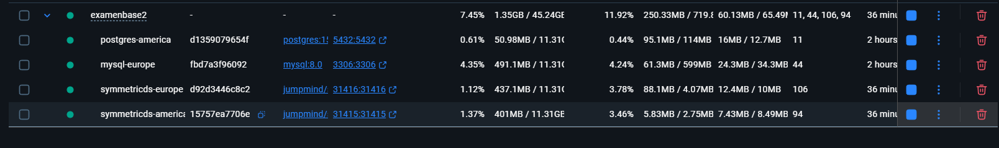
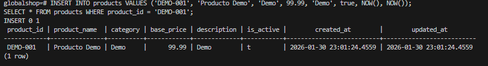
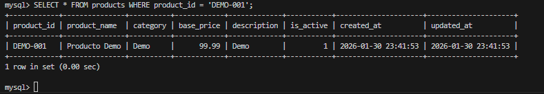
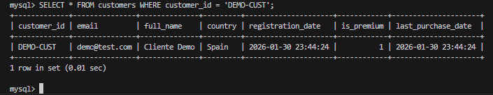
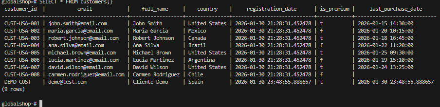
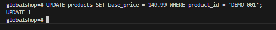
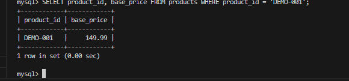
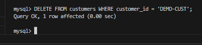
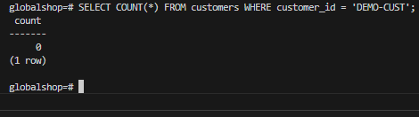

# Replicación Bidireccional Examen ABDD

## Estudiante
- **Joel Alejandro Barrera Vaca** [Tu nombre]
- **1753774122** [Tu cédula]
- **01-30-2026** [Fecha de pruebas]

## Descripción de las Capturas
### 01_arquitectura.png

Vista general de la arquitectura del sistema, donde se observan los contenedores de PostgreSQL, MySQL y SymmetricDS desplegados correctamente, formando la base de la replicación bidireccional.

### 01_arquitectura_up.png

Ejecución del comando docker compose ps, mostrando que todos los contenedores se encuentran en estado Healthy, lo que confirma que los servicios están activos y escuchando conexiones.

### 02_insert_postgres.png

Inserción de un registro de prueba en PostgreSQL (América) dentro de la tabla products, utilizada como origen para validar la replicación hacia MySQL.

### 02_verificacion_mysql.png

Verificación en MySQL (Europa) del registro insertado previamente en PostgreSQL, confirmando que la replicación desde PostgreSQL hacia MySQL se realizó correctamente.

### 03_insert_mysql.png

Inserción de un cliente de prueba en MySQL (Europa) dentro de la tabla customers, como parte de la validación de la replicación en sentido inverso.*

### 03_verificacion_pg.png

Confirmación en PostgreSQL (América) de la réplica automática del cliente insertado en MySQL, evidenciando la replicación bidireccional.

### 04_update_pg.png

Actualización del campo base_price de un producto en PostgreSQL, utilizada para comprobar la correcta propagación de cambios hacia MySQL.

### 04_verificacion_update_mysql.png

Verificación en MySQL de la actualización realizada en PostgreSQL, demostrando que las operaciones UPDATE se replican correctamente.

### 05_delete_mysql.png

Eliminación de un registro de cliente en MySQL, como prueba del proceso de replicación para operaciones DELETE.

### 05_delete_verificacion_pg.png

Confirmación en PostgreSQL de que el registro eliminado en MySQL ya no existe, validando la replicación bidireccional de eliminaciones.