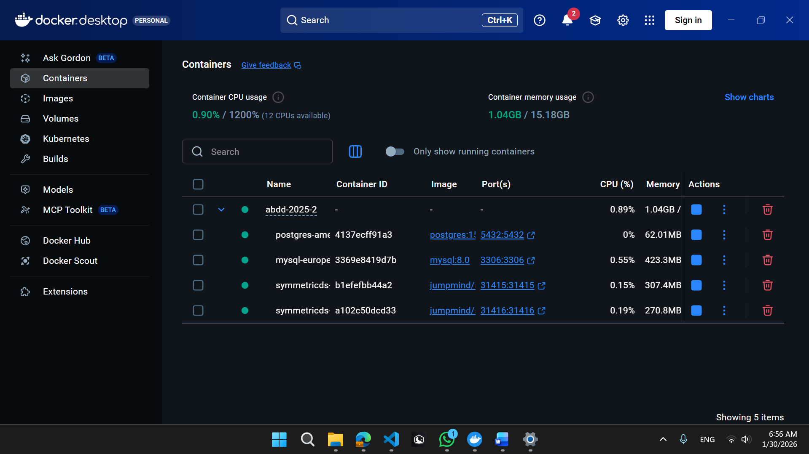
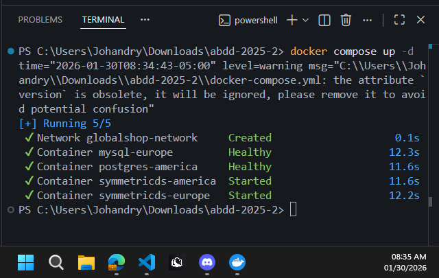
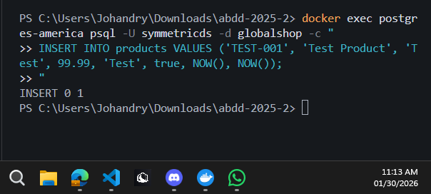
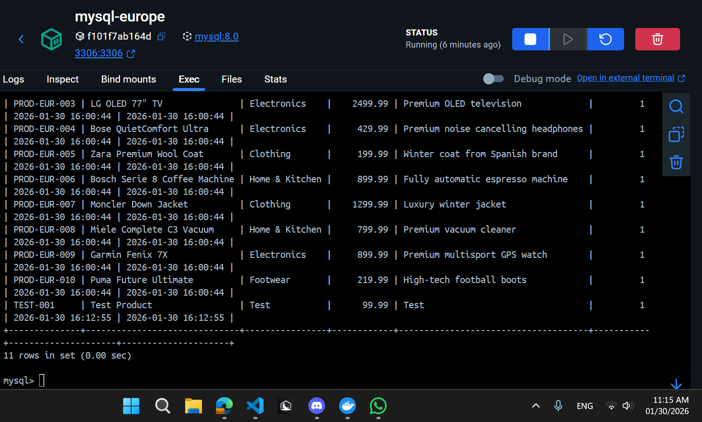
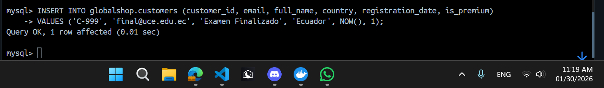
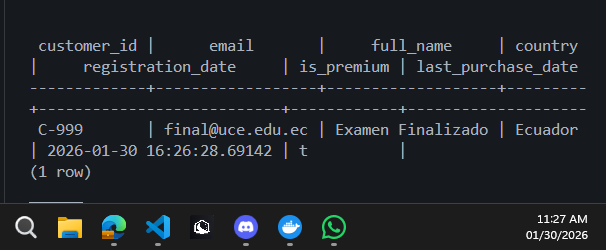
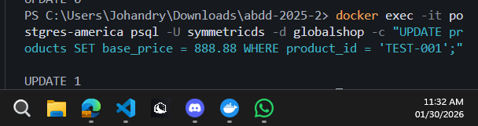
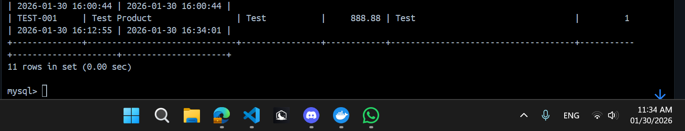
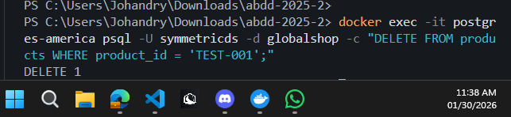
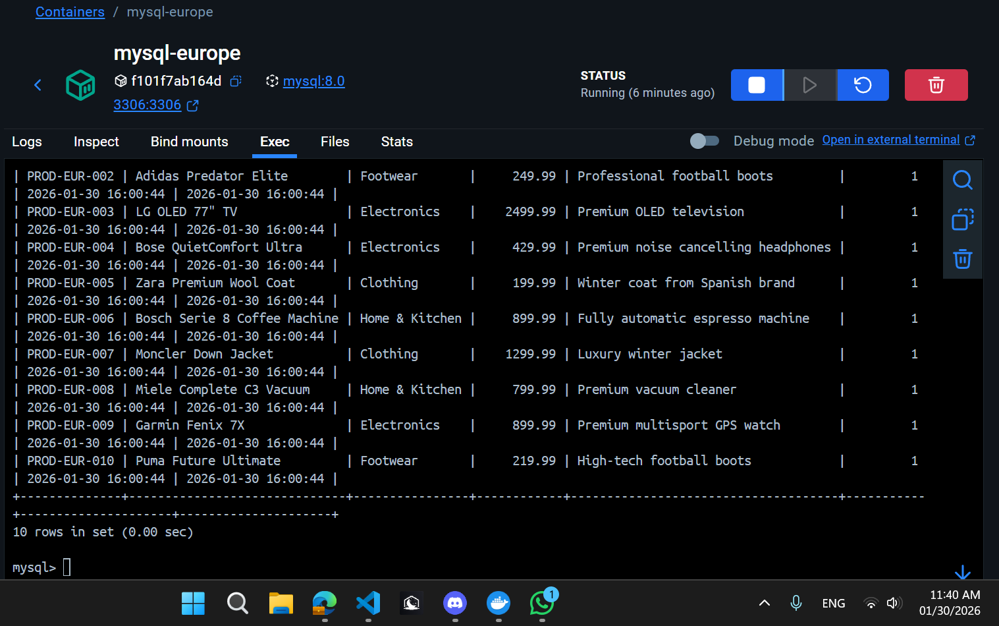

# Evidencias de Replicación Bidireccional

## Estudiante
- **Johandry Andres Viles Lopez** [Tu nombre]
- **1315641827** [Tu cédula]
- **01/30/2026** [Fecha de pruebas]

## Descripción de Capturas

### 01_Arquitectura.png

Muestra los 4 contenedores levantados correctamente.
Comando para levantar los servicios:
*docker compose up -d*

### 01_Arquitectura_Escuchando.png

Captura de los servicios y puertos en estado "LISTEN" indicando que los contenedores están aceptando conexiones.

### 02.1_insert_pg_mysql.png

Registro insertado en PostgreSQL que se replica correctamente hacia MySQL.
Inserción de prueba en PostgreSQL (Source: America):
*docker exec postgres-america psql -U symmetricds -d globalshop -c "INSERT INTO products VALUES ('TEST-001', 'Test Product', 'Test', 99.99, 'Test', true, NOW(), NOW());"*

### 02.1.1_insert_verificacion_mysql.png

Evidencia de una inserción realizada y verificada en la base de datos MySQL tras la replicación.
Verificación de la replicación en MySQL (Target: Europe):
*mysql> SELECT * FROM products WHERE product_id = 'TEST-001';* 
-- Resultado: 11 rows in set (Se visualiza el registro TEST-001 al final de la tabla)

### 02.2_insert_mysql_pg.png

Registro insertado en MySQL que se replica correctamente hacia PostgreSQL.
Inserción de cliente en MySQL (Source: Europe):
*mysql> INSERT INTO globalshop.customers (customer_id, email, full_name, country, registration_date, is_premium) -> VALUES ('C-999', 'final@uce.edu.ec', 'Examen Finalizado', 'Ecuador', NOW(), 1);*

### 02.2.1_insert_verificacion_pg.png

Comprobación de que la fila insertada aparece en PostgreSQL después del proceso de replicación.
Verificación de la replicación en PostgreSQL (Target: America):
*globalshop=# SELECT customer_id, email, full_name, country, registration_date, is_premium FROM customers WHERE customer_id = 'C-999';*

### 03_Update_pg_mysql.png

Evidencia de una actualización en PostgreSQL que se replica y aplica en MySQL.
Actualización de precio en PostgreSQL:
*docker exec -it postgres-america psql -U symmetricds -d globalshop -c "UPDATE products SET base_price = 888.88 WHERE product_id = 'TEST-001';"*

### 03_Update_Verificacion_mysql.png

Comprobación en MySQL de los cambios realizados por la actualización replicada.
Verificación del cambio de precio en MySQL:
*mysql> SELECT * FROM products WHERE product_id = 'TEST-001';*
-- Se observa el campo base_price actualizado a 888.88

### 04_Delete_pg_mysql.png

Evidencia de un borrado ejecutado en PostgreSQL que se refleja en MySQL.
Eliminación de registro en PostgreSQL:
*docker exec -it postgres-america psql -U symmetricds -d globalshop -c "DELETE FROM products WHERE product_id = 'TEST-001';"*

### 04_Delete_Verificacion_mysql.png

Comprobación en MySQL de la eliminación replicada desde PostgreSQL.
Verificación de la eliminación en MySQL:
*mysql> SELECT * FROM products;*
-- 10 rows in set (El registro TEST-001 ya no existe en la tabla)